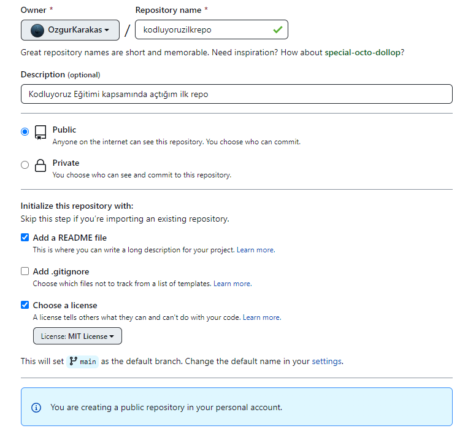

# Kodluyoruz Ilk Repo

Bu repo [Kodluyoruz](https://www.kodluyoruz.org/) Front-End Eğitiminde oluşturduğumuz ilk repo. İçerisinde bir adet
README dosyası, bir adet de index.html barındırıyor.

## Installation

Öncelikle projeyi clonelayın.(Buraya sizin reponuzdan aldığınız link gelecek)

```bash
https://github.com/OzgurKarakas/kodluyoruzilkrepo.git
```

## Usage
 
 Projeyi cloneladıktan sonra Visual Studio Code programında açınız.

 Linux için;

 ```Linux
 cd kodluyoruzilkrepo
 code .
 ```

 ## Contributing

 Pull requestler kabul edilir. Büyük değişikler için lütfen önce neyi değiştirmek istediğinizi tartışmak için bir konu açınız.

 ## Project Picture



 ## License

 [MIT](https://choosealicense.com/licenses/mit/)

 [Patika.dev](https://app.patika.dev/paths)
 
 [Patika.dev profilim](https://app.patika.dev/ozgur_)


